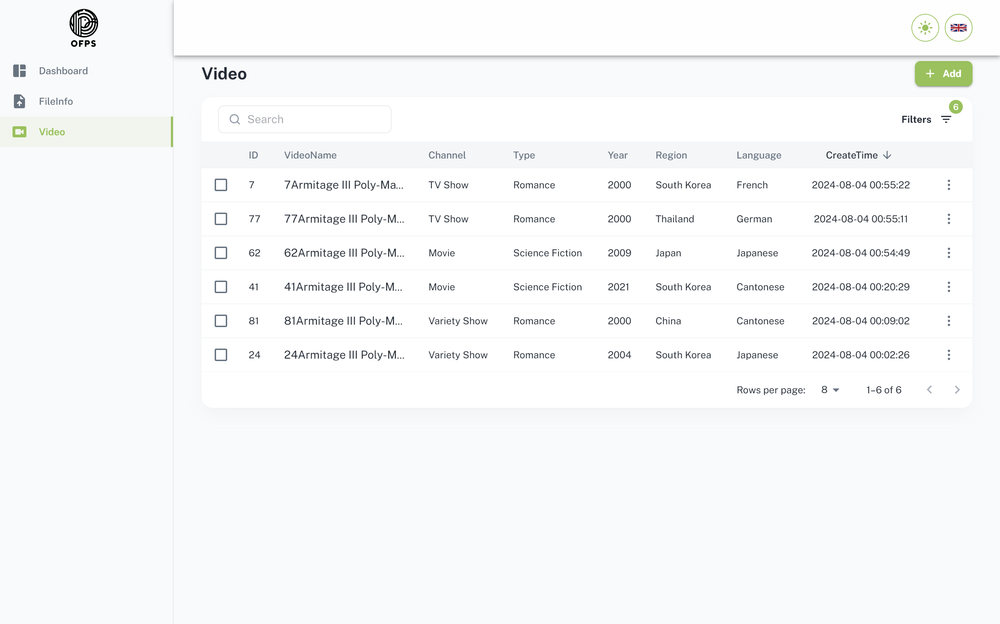

# OFPS

### Simple and Intuitive Admin Dashboard Interface

[](img/ProjectImage.png)

## Overview

This project is a customized development based on the [minimal-ui-kit (Free version)](https://github.com/minimal-ui-kit/material-kit-react). It offers a simple and intuitive admin dashboard interface that facilitates rapid backend customization and development.

### Key Features

- **TypeScript Support**: Integrated TypeScript support as the free version doesn't include it.
- **Dark and Light Mode Toggle**: Seamlessly switch between dark and light modes.
- **Internationalization**: Multi-language support for a global reach.
- **Table Data Management**: Sorting, filtering, and searching of table data.
- **File Upload**: Efficient file upload capabilities.
- **System Notifications**: System-wide popup notifications for a better user experience.

## Quick Start

### Prerequisites

- [Docker](https://www.docker.com/get-started)
- [Docker Compose](https://docs.docker.com/compose/install/)

### Setup Instructions

1. **Clone the Repository**

   ```bash
   git clone https://github.com/jayliu3/jay-ofps.git
   cd jay-ofps
   ```

2. **Start the Services**

   ```bash
   docker-compose up -d
   ```

3. **Database Initialization**

   ```bash
   script.sql
   ```

- To initialize the database with your script, ensure that the script is correctly placed and executed within the SQL Server container.

### Accessing the Application

- Open your browser and navigate to `http://localhost:8080`.

### Demo

- `http://138.2.113.17:8001/`

## License

This project is licensed under the MIT License. See the [LICENSE](LICENSE.md) file for details.
